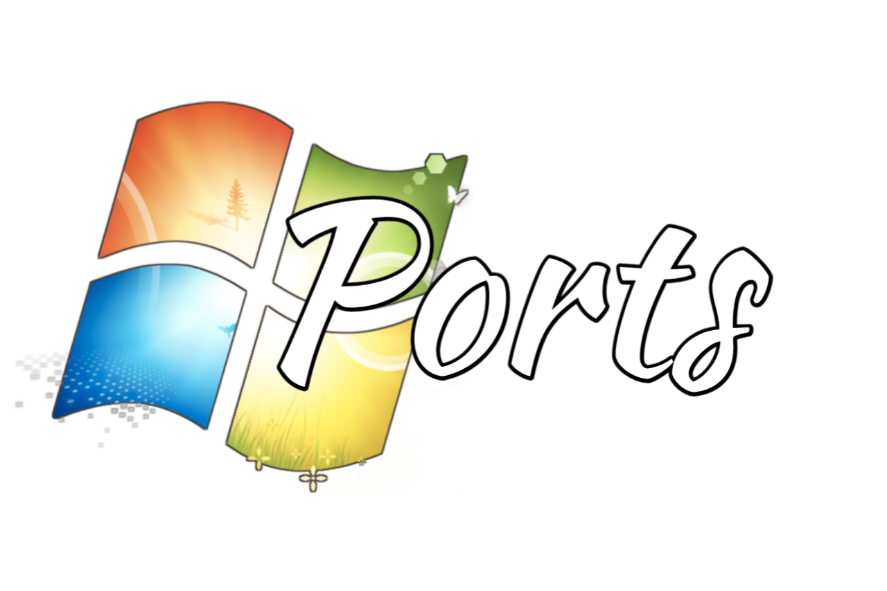

  It is a collection of electron applications updated for Windows 10 but adapted to run on Windows 7.

# 🌱 What software will exist?

All programs (those that function and can provide some of their functionalities) that are based on Electron, compiled on a patched version of Electron to run on Windows 7.

# Patched programs

- ArmCord
- VSCodium
- Github Desktop 
- GoofCord

# How long will it take for new programs and updates to appear?

As mentioned above, I need to provide certain functionalities for an Electron-based program to work correctly, and updates will be manual. However, how quickly these updates appear depends on whether the changes are not major

# How to run/install it?

Extract the ZIP file wherever you want and run the EXE.

# Source code ?
Unfortunately, at the moment I do not wish to provide the source code. Perhaps in the future, I might consider making it available.

# License

- Electron [MIT](https://github.com/electron/electron/blob/main/LICENSE)
- ArmCord [OSL-3.0](https://github.com/ArmCord/ArmCord/tree/dev?tab=OSL-3.0-1-ov-file#OSL-3.0-1-ov-file)
- VSCodium [MIT](https://github.com/VSCodium/vscodium/blob/master/LICENSE)
- GithubDesktop [MIT](https://github.com/desktop/desktop/blob/development/LICENSE)
- GoofCord [OSL-3.0](https://github.com/Milkshiift/GoofCord?tab=readme-ov-file#OSL-3.0-1-ov-file)
- Rocket.Chat [MIT](https://github.com/RocketChat/Rocket.Chat.Electron?tab=MIT-1-ov-file#MIT-1-ov-file)

Any logos, images, or source code do not belong to me !
